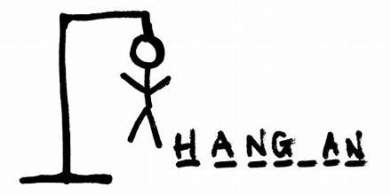

  

# Hangman Game AI

This project aims to develop an AI-driven Hangman game using various advanced machine learning techniques. The project leverages a combination of models and methods to predict missing letters in a word, enhancing the Hangman gameplay experience. The core methodologies include a Bidirectional LSTM (BiLSTM) model, a Directed Acyclic Word Graph (DAWG) structure, and a BERT model.

## Project Overview

The goal is to build an AI that can effectively guess letters in a Hangman game. The AI uses a combination of:

1. **Bidirectional LSTM Model**: For sequence processing and predicting the next possible characters.
2. **DAWG**: To prune down the word database and improve guessing accuracy by using frequency analysis.
3. **BERT**: For masked language modeling to predict missing characters in a sequence.

## Model Architectures and Methods

### Bidirectional LSTM Model

The BiLSTM model is a deep neural network designed for sequence processing tasks, such as text generation and sequence classification. The architecture combines embedding, convolutional, recurrent (LSTM), and dense layers to effectively capture and predict sequences.

#### Architecture

- **Embedding Layer**: Transforms integer indices (representing characters or words) into dense vectors of size 128, capturing semantic information.
- **1D Convolutional Layer**: Applies 128 filters of kernel size 3 with 'same' padding and ReLU activation to extract local feature patterns.
- **Bidirectional LSTM Layer**: Comprises LSTM units with 256 neurons each, processing data in both forward and backward directions to capture dependencies from both past and future contexts. It uses L2 regularization to prevent overfitting and returns sequences for subsequent layers.
- **Dropout Layer**: Applies a dropout rate of 0.4 to reduce overfitting by randomly setting a proportion of input units to 0 during training.
- **TimeDistributed Dense Layer**: Applies a dense layer to every time-step of the input sequence, using a softmax activation function to produce a probability distribution over the character set for each time step.

#### Training Details

- **Loss Function**: Categorical Crossentropy
- **Optimizer**: Adam
- **Metrics**: Accuracy
- **Early Stopping**: Stops training if the validation loss does not improve for three consecutive epochs and restores the best model weights.

### Directed Acyclic Word Graph (DAWG)

The DAWG data structure is used to efficiently manage and search a large vocabulary of words, pruning the word database to find matches for the target word.

#### Components

- **Node**: Represents each character in the word, with children nodes for subsequent characters.
- **DAWG**: Contains the root node and methods to add words and search for possible matches based on a given pattern.

#### Methodology

- **Add Word**: Adds words to the DAWG structure by creating nodes for each character.
- **Generate Possible Words**: Uses Depth-First Search (DFS) to find all possible words matching a given pattern.
- **Predict Next Letter**: Analyzes the frequency of letters in the possible words and predicts the next letter, switching to the BiLSTM model when 70% of the word is predicted.

### BERT Model

BERT (Bidirectional Encoder Representations from Transformers) is used for masked language modeling to predict missing characters in sequences.

#### Architecture

- **Tokenizer**: BERT tokenizer to convert words into tokens and manage masked tokens.
- **BERT Model**: Pre-trained BERT model for masked language modeling, fine-tuned on the dataset.

#### Training Details

- **Dataset**: Custom dataset with dynamically masked characters.
- **Data Loader**: Pytorch DataLoader with dynamic masking and padding.
- **Optimizer**: AdamW with a learning rate of 1e-4.
- **Scheduler**: Linear schedule with warmup for training steps.
- **Gradient Clipping**: Ensures gradient norms are within a safe range to prevent exploding gradients.

## Implementation

### Data Preparation

1. **Loading Data**: Reads a list of words from a text file.
2. **Simulating Missing Letters**: Randomly replaces letters with '0' to simulate missing letters.
3. **Preprocessing**: Converts characters to integers, pads sequences, and prepares target sequences for training.

### Training the BiLSTM Model

1. **Model Definition**: Defines the sequential model with embedding, convolutional, LSTM, dropout, and TimeDistributed dense layers.
2. **Compilation**: Compiles the model with categorical crossentropy loss, Adam optimizer, and accuracy metrics.
3. **Training**: Trains the model with early stopping based on validation loss.

### DAWG Implementation

1. **Node and DAWG Classes**: Implements the classes to manage the word graph.
2. **Word Addition**: Adds words to the DAWG structure.
3. **Prediction**: Uses letter frequency analysis and switches to BiLSTM for final predictions.

### BERT Model Training

1. **Dataset Class**: Custom dataset class for dynamic masking and tokenization.
2. **Data Collator**: Prepares batches for masked language modeling.
3. **Model Training**: Trains the BERT model with a linear learning rate schedule and gradient clipping.

## Usage

The AI combines the strengths of BiLSTM, DAWG, and BERT to predict missing letters in a word, providing a robust solution for playing the Hangman game. The DAWG structure prunes the search space, while the BiLSTM and BERT models provide accurate predictions based on sequence and contextual information.

## Conclusion

This project demonstrates the integration of advanced machine learning models and data structures to enhance the Hangman game experience. The combination of BiLSTM, DAWG, and BERT models ensures high accuracy and efficient performance, making it a powerful tool for sequence prediction tasks.
